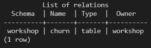
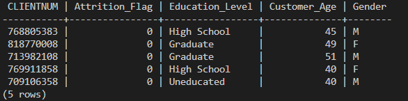
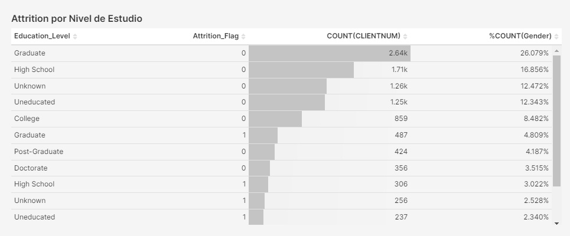
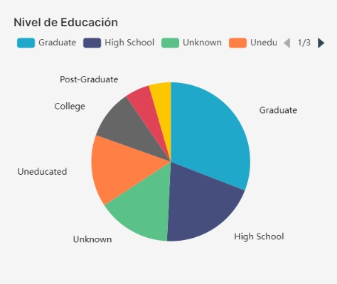
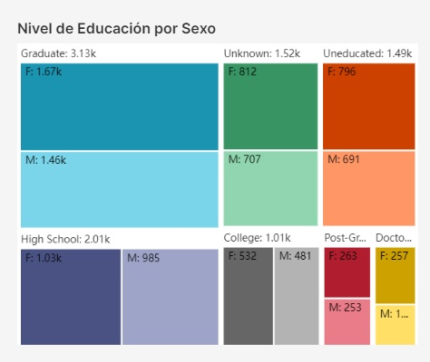
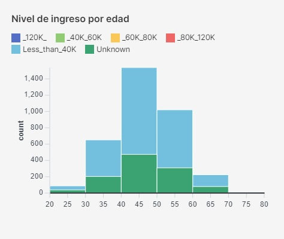

Seminario Intensivo de Tópicos Avanzados en Datos Complejos

# Trabajo Práctico

## Contenidos
* [Introducción al proyecto](#Introducción-al-proyecto)
* [Dataset](#Dataset)
* [Levantar el ambiente](#levantar-el-ambiente)
* [ETFL](#etfl)
* [Ver base de datos en Superset](#ver-base-de-datos-en-superset)
* [Conclusiones](#conclusiones)


## Introducción al proyecto
Para integrar el material que se ha cubierto durante el seminario, en este trabajo práctico haremos un proceso de ETFL (Extract Transform Fit Load) de un dataset público. Aunque el dataset es relativamente liviano (10,000 registros con 20 features aproximadamente) el proceso de ETFL va a ser realizado en un entorno distribuido para así complementar y reforzar los conocimientos adquiridos en la materia previa de grandes volúmenes de datos. Esto no solo es fundamental para entender el proceso subyacente de estos ambientes de *Big Data*, sino además es una buena oportunidad para incursionar en la sintáxis de `PySpark`.

Los datos trabajados van a ser luego cargados en una base de datos `Postgres` para finalmente ser levantados en `Superset` para su posterior análisis mediante gráficos y dashboards. Para todo esto utilizaremos `Docker` para conteinizar cada aplicación, aprovechando la ventaja de portabilidad que lo hace asi independiente del sistema operativo de quienes lo ejecuten y todo el proceso pueda así correr sin problemas en cualquier plataforma o incluso en Cloud.

Vale la pena notar que la data a procesar es ingestada una única vez, ya que los datos son estáticos. Por lo que no habia una clara ventaja en utilizar Airflow. También se planteó si tenia sentido correr el script de PySpark de manera automática, es decir, crear un proceso que dispare Python que corra el script en su container correspondiente. Pero en una segunda impresión esto no parecía algo muy práctico por ser una tarea trivial al ser una única tarea sin necesidad de orquestación. Quizás sería más eficiente que el script se disparase automáticamente tan pronto se levantara el container.


## Levantar el ambiente


## Comprensión del Dataset
El ejercicio de ETFL se basará en un [dataset](https://www.kaggle.com/datasets/sakshigoyal7/credit-card-customers?select=BankChurners.csv) disponible en la plataforma [Kaggle](https://www.kaggle.com "Kaggle's Homepage").

El dataset en formato csv ha utilizar contiene 10,127 registros y 22 columnas respecto al churn de clientes de un banco. El propósito es poder desarrollar un modelo que permita anticiparse a la decisión de un cliente de prescindir de los servicios del banco para irse a la competencia.
Los registros (o filas) corresponden a cada cliente que actualmente es, o en su momento fue cliente del banco. Las columnas se dividen en dos grandes grupos:

* Datos demográficos: edad, género, cantidad de dependientes, nivel de educación, estado civil, nivel de ingreso.
* Datos transaccionales o especificos del banco: antigüedad del cliente, tipo de tarjeta de crédito, meses sin actividad, límite de crédito, balance de la cuenta, cantidad y monto de transacciones en el año, variación de la cantidad y el monto de las transacciones en el período Q4-Q1, grado de utilización de la tarjeta de crédito. 

Importante notar que el churn de los clientes es de aproximadamente un 16%, por lo que se trabaja con un dataset desbalanceado.

## ETFL
1. **Extracción de los datos -** Como se mencionó anteriormente, el dataset en formato csv se extrajo de la página de Kaggle. La intención original era que el script de python accediera directamente a la página para su debida extracción cada vez que se ejecutara. Lamentablemente no se encontró la manera de hacer el vínculo directo, por lo que, aunque no es lo ideal, se decidió bajar el archivo a la máquina local para que quede en el repositorio en  *bigdata-workshop-es/dataset/BankChurners.csv*. De todos modos se menciona en el script de Python cuales serían los comandos a utilizar si se hubiera podido hacer el vínculo directo.

2. **Transformación -** Para la limpieza del dataset realizamos las siguientes operaciones:
    * Se deja que PySpark infiera el esquema de los datos meiante InferSchema y se corrobora que fueron correctamente casteados.
    * La últimas dos columnas del archivo original se eliminan al no ser de utilidad para el análisis.
    * Vemos la proporción de Nulls y si el porcentaje es muy alto (>50%) eliminamos completamente esa columna. No hubo ningún caso. Luego, para el caso de featuros **numéricos** completamos los Nulls con el valor de la mediana. Para el caso de las variables **categóricas** los valores faltantes aparecen como *'Unknown'*. Una opción sería completarlos con los valores que mas se repiten, pero dada la cantidad no parece una buena idea. Otra solución sería completarlo de manera proporcional a la cantidad de valores categóricos, pero eso ya seria un poco más complejo. Por lo que se decidió dejarlos así y asegurarnos que no estamos agregando ruido para los casos donde los valores ya son conocidos.
    * Se analizan todos las columnas numéricas para ver sus respectivas desviaciones starndards (<0.015) para eliminarlas en caso que así fuera por no agregar valor. Pero no hubo ningún caso.
    * Se grafican mediante la libreria de `matplotlib` todas las variables numéricas para ver si tienen una distribución relativamente normal. El algoritmo de regresión logística a utilizar responde mejor bajo estas condiciones. De este análisis se encontraron cinco features con distribución asimétrica, por lo que se decidió aplicar una transformación logarítmica para normalizarlas.
    * Se agrega una columna de training que luego se usará en el fitteo del modelo. La relación es 80% training y 20% testing.

3. **Fit -** Para predecir el label *Attrition* (i.e.: *churn*) en este ejercicio se usará un modelo parámetrico de regresión logistica de PySpark, ya que se trata de un problema de clasificación binaria (el cliente va a quedarse o irse). En principio un modelo paramétrico que ajuste bien sin overfitting es ideal ya que es más fácil de interpretar.

Luego se aplica la función de *OneHotEncoding* a las variables categóricas ya que el modelo tiene que recibir variables continuas para un funcionamiento correcto.

Las métricas resultantes para evaluar el desempeño del modelo dan una Precisión del 79.3% y una Cobertura del 64.5% para el Label correspondiente a Attrition. El Accuracy, en cambio, es de 91.4%. Y el evaluador arroja un desepeño del 93.1%.

Un punto a tener en cuenta para un próximo análisis es que el modelo en este caso no trabaja con *validación* durante la etapa de training. También sería importante compensar el desbalance del dataset ya que la clase minoritaria (clientes con *attrition*) es de solo un 16% del total de registros.

4. **Load -** Una vez ya limpiados y transformados los datos (pero previo al uso del *OneHotEncoder* arriba descripto) lo persistimos en una base de datos `Postgres`. Esto nos va a permitir, entre otras cosas, acceder a este nuevo dataset desde herramientas de visualización, tales como `Superset` para diversos tipos de análisis, como veremos en el apartado siguiente.

## Ver base de datos en Superset
Como se comentó más arriba, las datos se han persistido en una BD en `Postgres`. Desde una terminal de `bash` podemos acceder al **container** correspondiente via

```bash
docker exec -it postgres bash
```
Una vez dentro del container corremos el siguiente comando para poder ver la tabla que se creó.
```Postgres
psql -U workshop workshop
workshop=# \d
```
Obteniendo así la tabla **churn**. 



Desde aquí mismo podríamos correr una query para ver el contenido de la tabla. Veamos algunas columnas:

``` postgres
workshop=# SELECT "CLIENTNUM","Attrition_Flag", "Education_Level","Customer_Age", "Gender" FROM churn limit 5;
```


Desde `Superset` creamos el vínculo a la base de datos Postgres y levantamos la tabla **churn**.

Creamos un dashboard donde vamos agregando distintos gráficos: pie chart, tabla, tree-map y un histograma.











## Conclusiones


